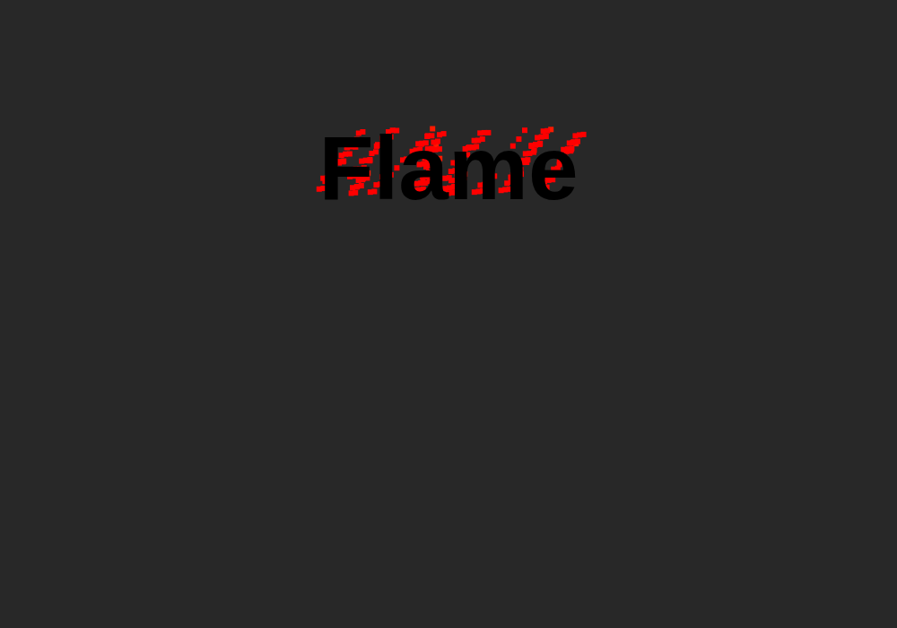
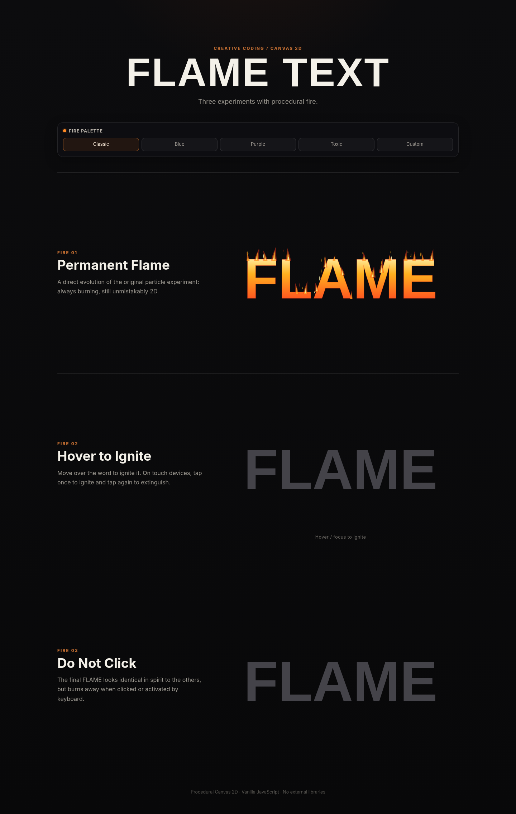
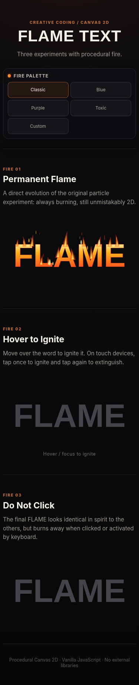

# Flame Text 🔥

A lightweight creative-coding showcase built with **HTML, CSS, vanilla JavaScript, and Canvas 2D**. Flame Text started as a small pixel-particle experiment and has been rebuilt as a responsive V2 with three independent procedural fire interactions, shared color controls, and a performance-conscious animation engine.

No frameworks, particle libraries, GIFs, videos, sprites, or external runtime dependencies are required.

## Origin

The original version was a compact experiment: a single heading, two canvases, square particles, a color cycle, and a particle limit that could grow as high as 7,000 particles. It captured the core idea — animated fire around text — but it was designed as an early visual experiment rather than a reusable interactive showcase.

V2 keeps that same 2D identity while rebuilding the visuals, interaction model, architecture, responsiveness, and runtime behavior.

## Screenshots

### V1 — Original experiment



### V2 — Current version



### Responsive / touch layout



## V1 vs V2

| Feature | V1 | V2 |
|---|---|---|
| Fire system | Basic square pixel particles | Layered procedural 2D flame tongues, particles and embers |
| Effects | 1 | 3 |
| Interaction | Static animation | Permanent fire, hover/tap ignition, click-to-burn destruction |
| Color system | Timed basic color cycle | Classic, Blue, Purple, Toxic and Custom palettes |
| Custom colors | Code edits | Live Core / Mid / Outer color inputs |
| Particle strategy | Array growing up to 7,000 particles | Small adaptive budgets with shared object pooling |
| Rendering | Two dynamically positioned canvases | Three local, size-bounded Canvas 2D surfaces |
| Performance control | Always-running animation | Visibility pausing, tab pausing, adaptive quality and DPR caps |
| Mobile | Limited | Responsive layout with touch fallback |
| Touch interaction | No dedicated behavior | Tap to ignite/extinguish Fire 02 |
| Accessibility | Not implemented | Keyboard controls, visible focus and reduced-motion support |
| Architecture | Single experimental script | Reusable engine, pooled particles and independent effect classes |
| Visual goal | Early particle prototype | Polished creative-coding showcase |

## The Three Fire Experiments

### Fire 01 — Permanent Flame

The first demo is the direct visual descendant of V1. `FLAME` remains permanently ignited, but the old blocks are replaced by a combination of:

- procedural tapered flame tongues;
- a hot core → mid-temperature → outer-edge palette;
- lightweight drifting embers;
- animated vertical variation and horizontal sway;
- a bounded particle budget instead of brute-force density.

The result stays intentionally 2D and stylized rather than attempting photorealistic fire.

### Fire 02 — Hover to Ignite

The second `FLAME` starts as a cool charcoal/metallic word.

On desktop, hovering or focusing the word progressively increases the fire intensity. When the pointer leaves, the fire fades instead of disappearing instantly, allowing remaining embers to finish their lifetime naturally.

On touch devices, the interaction changes to a toggle:

1. tap once to ignite;
2. tap again to extinguish.

Keyboard users can focus the word and use **Enter** or **Space** to toggle the effect.

### Fire 03 — Do Not Click

The third experiment starts as the same large uppercase word used by the other demos:

> **FLAME**

After activation, the effect moves through an ignition / burn / disintegration / ember / smoke sequence. The destruction is not a simple opacity fade: the canvas-rendered word is progressively removed using a deterministic cell-based dissolve while fragments and fire particles are emitted from the consumed area.

After the burn finishes, the interface displays:

> You were warned. 🔥

The **Restore** button rebuilds the experiment so it can be replayed without reloading the page.

## Fire Palette

All three experiments share one palette controller.

Included presets:

- **Classic** — warm white/yellow → orange → red;
- **Blue** — white → cyan → blue;
- **Purple** — pink-white → purple → violet;
- **Toxic** — yellow → neon green → dark green;
- **Custom** — native color inputs for `Core`, `Mid`, and `Outer`.

Palette changes are applied immediately to every effect.

## Performance Improvements

Performance was treated as a core feature rather than an afterthought.

V2 includes:

- one central `requestAnimationFrame` loop;
- delta-time based motion;
- a shared `ParticlePool` to reduce repeated object allocation;
- bounded particle budgets instead of unbounded arrays;
- adaptive High / Medium / Low quality levels;
- automatic quality reduction when recent frame time drops;
- lower initial quality on small or lower-core-count devices;
- capped `devicePixelRatio` for Canvas rendering;
- `IntersectionObserver` pausing for off-screen experiments;
- complete animation-loop suspension while the document is hidden;
- local canvases sized only to each experiment instead of full-screen particle surfaces;
- no DOM particles;
- no large `box-shadow` particle lists;
- no per-frame `getBoundingClientRect()` calls;
- no external animation or particle libraries.

Typical V2 budgets are only a few hundred particles per active effect at the highest quality level, and the budgets scale down further on mobile or reduced-motion configurations.

## Responsive Design

The layout uses fluid sizing, Grid/Flexbox, `clamp()`, and compact breakpoints. The fire canvases inherit the width of their experiment area and are resized with a capped pixel ratio.

The project is designed to work from small mobile screens through desktop displays, including common widths such as 320, 360, 375, 390, 412, 430, 1366 and 1920 pixels without horizontal overflow.

## Accessibility

V2 adds:

- a skip link;
- semantic sections and headings;
- accessible labels for canvas-driven controls;
- visible keyboard focus;
- keyboard activation for interactive experiments;
- touch alternatives where hover is unavailable;
- `prefers-reduced-motion` support that lowers particle intensity and shortens the destructive sequence while preserving the visual concept.

## Technologies

- HTML5
- CSS3
- JavaScript (ES6+)
- Canvas 2D API
- `requestAnimationFrame`
- `IntersectionObserver`
- native `<input type="color">`

## Project Structure

The repository intentionally stays flat so the files can be uploaded directly through GitHub's **Add file → Upload files** flow.

```text
flame-text/
├── index.html
├── style.css
├── script.js
├── favicon.svg
├── README.md
├── flame-text-v1.png
├── flame-text-v2.png
└── flame-text-v2-mobile.png
```

## Run Locally

No build step is required.

You can simply open `index.html` in a modern browser.

For a local HTTP server, you can also run:

```bash
python3 -m http.server 8000
```

Then open `http://localhost:8000`.

## GitHub Pages

The project is fully static and is compatible with GitHub Pages.

After uploading the files to the repository root:

1. open **Settings → Pages**;
2. choose the branch that contains the project;
3. select the repository root as the publishing source;
4. save and wait for GitHub Pages to deploy the update.

No server, package manager, build command, API key, or environment variable is required.

## Notes

The fire is generated procedurally at runtime. The project intentionally avoids external scripts and runtime CDN dependencies so the showcase remains portable, auditable, and easy to host as a static GitHub Pages project.
